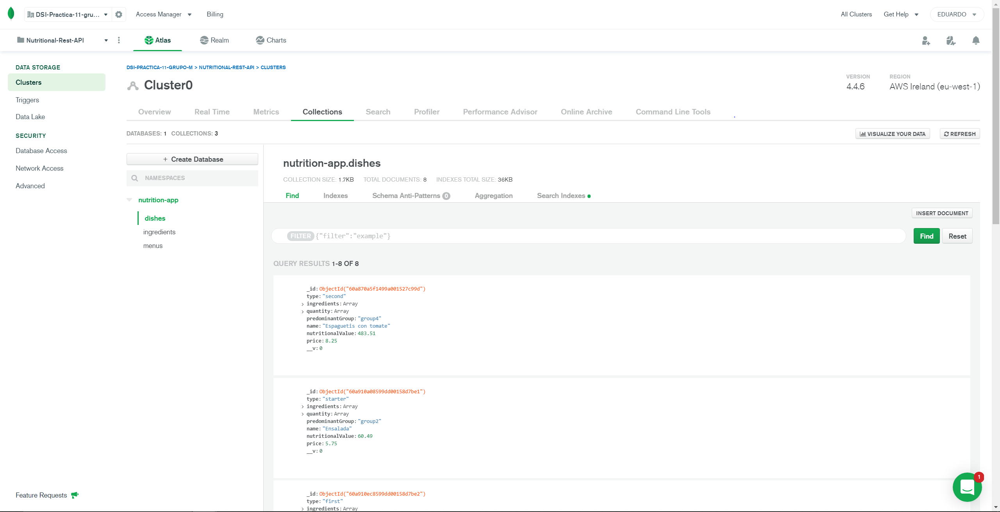
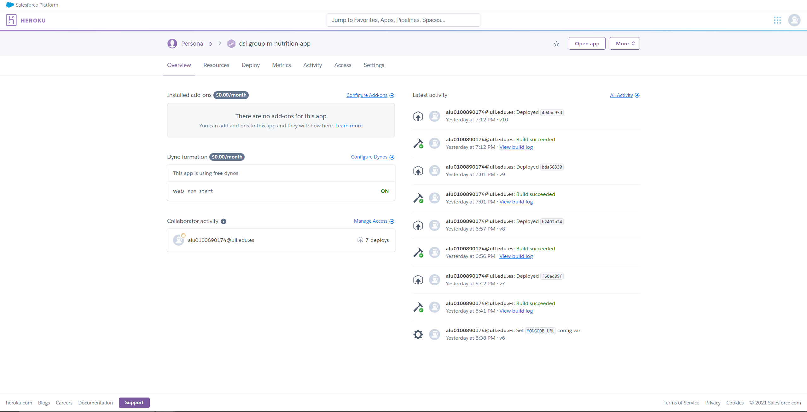
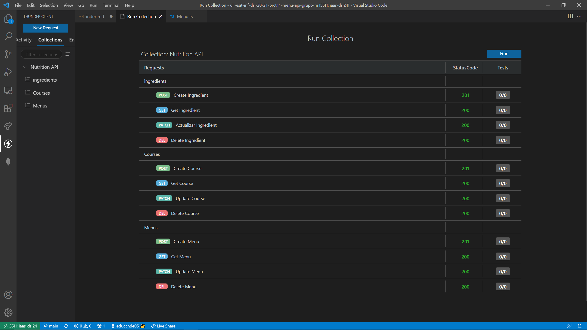

# Práctica 11. API Node/Express de gestión de información nutricional

----------------------------------------------------------
Grupo M   |   ALUS
----------------------------------------------------------
Karina Kalwani |   alu0101109046@ull.edu.es
----------------------------------------------------------
Micaela Lucia Mungay Juncal |   alu0101124506@ull.edu.es
----------------------------------------------------------
Carla Oval Torres |   alu0101036694@ull.edu.es
----------------------------------------------------------
Eduardo Pérez Suárez |   alu0100890174@ull.edu.es
----------------------------------------------------------
Xue Mei Lin |   alu0101225845@ull.edu.es
----------------------------------------------------------

## Repositorio de GitHub con el código fuente de la práctica

[https://github.com/ULL-ESIT-INF-DSI-2021/ull-esit-inf-dsi-20-21-prct11-menu-api-grupo-m](https://github.com/ULL-ESIT-INF-DSI-2021/ull-esit-inf-dsi-20-21-prct11-menu-api-grupo-m)


## 1. Descripción de la práctica

En esta práctica tendremos que desarrollar una API basándonos en la anterior práctica grupal que hemos desarrollado. Las instrucciones de la tarea se encuentran en el siguiente recurso:

https://ull-esit-inf-dsi-2021.github.io/prct11-menu-api/

Sintetizando, tendremos que implementar una API, haciendo uso de Node/Express, que permita llevar a cabo operaciones de creación, lectura, modificación y borrado (Create, Read, Update, Delete - CRUD) de ingredientes, platos y menús.
Los requisitos que se nos exigen en la práctica abarcan la existencia de un objeto Alimento/Ingrediente, un objeto Plato, un objeto Menú, un objeto Carta y un objeto Comanda, que ya implementamos en la práctica anterior. Estos objetos interactuarán entre sí y tendrán cada uno una serie de elementos internos, atributos o características que los componen. 

A continuación, se enumeran algunos requisitos que deberá cumplir el API, en lo que respecta a las diferentes rutas o puntos de acceso JSON que deberá proporcionar:

- En la ruta /ingredients del API, se deberá poder crear, leer, actualizar o borrar un ingrediente a través de los métodos HTTP necesarios. Las características de estos elementos serán las mismas que definimos en la práctica anterior.

- En la ruta /courses del API, se deberá poder crear, leer, actualizar o borrar un plato a través de los métodos HTTP necesarios. Los platos de un menú estarán compuestos por alimentos y/o ingredientes como los definidos anteriormente.

- En la ruta /menus del API, se deberá poder crear, leer, actualizar o borrar un menú a través de los métodos HTTP necesarios. Como definimos anteriormente, un menú estará compuesto por platos, incluyendo un plato de cada categoría o, al menos, tres de ellas. Para cada menú, se debe poder consultar la siguiente información

## 2. Enunciados de los distintos elementos u objetos propuestos en el ejercicio

Hemos utilizado la estructura de las clases Alimento/Ingrediente, Plato y Menú de la práctica anterior número 7 para definir nuevos esquemas propios de Mongoose, estos esquemas implementan una interfaz extendida desde Documents para facilitar el manejo de sentencias query. Estos esquemas nos sirven para crear modelos de datos comprensibles para nuestra base de datos, permitiendonos usar funciones como find, save,... Funciones que nos permiten manipular nuestra BD.

### Ingredientes

Hemos definido un esquema mongoose tipo ingrediente o alimento, como lo queramos llamar (en nuestro caso hemos escogido "ingrediente"). Para cada alimento o ingrediente considerado dentro del sistema de diseño de menús se debe almacenar la información siguiente:

- Nombre del alimento
- Origen del alimento
- Grupo de alimentos al que pertenece (carnes, pescados, huevos, tofu, frutos secos, semillas o legumbres).
- Verduras y hortalizas.
- Leche y derivados.
- Cereales.
- Frutas.
- La composición nutricional del alimento, es decir, macronutrientes (hidratos de carbono, proteínas y lípidos) y kcal por 100 gr.
- Precio del alimento y/o ingrediente por kg en euros.


### Plato

También hemos definido un un esquema mongoose tipo plato. Los platos de un menú estarán compuestos por alimentos y/o ingredientes.

- Categoría (entrante, primer plato, segundo plato y postre).
- Lista de alimentos y/o ingredientes que lo componen.
- Composición nutricional del plato (suma de la composición nutricional de los alimentos que componen el plato. Hay que tener en cuenta que los valores nutricionales se definen por 100 gr de ingrediente, pero no siempre se usan 100 gr de cada ingrediente para elaborar un plato.
- Grupo de alimento predominante (entre los ingredientes del plato).
- Precio total del plato en euros en función de la suma de los precios de los ingredientes y sus cantidades que lo componen.

*Este esquema representa cada plato mediante una serie de atributos, los cuales serán los que nos transmitan la información sobre el mismo*

*Tiene un enumerable, el cual usamos para indicar el tipo de plato, que puede ser, según las categorías que hemos definido: entrante, primer plato, segundo plato o postre*

*Ademas tiene como atributos `price`, el cual representará el precio total del plato (calculado con el precio de cada ingrediente segun su peso), `predominantGroup` que nos dice el grupo alimenticio principal del plato (es decir, el que se repite mas veces), `name` el nombre del plato, `ingredients` que es un vector de ingredientes (en el cual ademas de almacenar el ingrediente almacena el peso en gramos que se utiliza del mismo), `nutritionalValue` valor total nutricional del plato, y por ultimo, `type`, que es donde se almacena el tipo de plato (es decir, el enumerable antes mencionado)*


### Menú

En cuanto al esquema mongoose tipo menú, este está compuesto por platos, incluyendo un plato de cada categoría o al menos tres de ellas. Para cada menú, se puede consultar la siguiente información:

- Precio total del menú en euros.
- Platos que lo componen con sus correspodientes alimentos y/o ingredientes.
- Composición nutricional del menú.
- Listado de grupos de alimentos por orden de aparición.

*Esta esquema representa cada menú del programa, es decir, cada uno de los conjuntos de platoscompuestos por platos del tipo entrante, primero, segundo o postre, mediante una serie de atributos que se explicarán a continuación*

*Tenemos `name`, el cual usamos como identificador para distinguir entre diferentes menus, `price` que nos da el precio total del menu calculado gracias a un metodo, `dishes` que es un vector que almacena la totalidad de platos del menu para poder trabajar con ellos de manera mas sencilla, `nutritionalValue` que contiene el valor nutricional total del menu, `listGroup` donde se almacenan los principales grupos alimenticios por los que está conformado el menu*


## 3. Implementación

Para empezar, nuestra base de datos de Mongoose estará compuesta por tres colecciones distintas y codependientes entre sí, que son `Ingredient`, `Dish` y `Menu` que hemos definido a partir de nuestro desarrollo de la anterior práctica grupal. Cada una de estas colecciones tendrá un schema propio.

### Ingredientes

La colección `Ingredientes` estará compuesta por una serie de atributos únicos con distintas funciones. Para empezar definimos como interfaz (`interface`) nuestro elemento `Ingredientes`. Algunos elementos de interés que hemos utilizado para definirlos son `type`, que en nuestro caso es `String` (debe ir en mayúscula), `unique`, que hace que no se repitan los nombres, `validate`, que nos comprueba una condición, en este caso que el nombre del ingrediente comienza con mayúscula y `trim`, que nos elimina los espacios sobrantes de un string.

El elemento `origin` lo hemos declarado como `String`, es un atributo requerido, al que le aplicamos el mismo `trim`. Para el caso del atributo `group` haremos lo mismo y además enumeramos sus posibles valores, y establecemos un valor por defecto en el caso de que no se le asigne ningún grupo, que será `group1`.

Para los atributos `lipids`, `proteins`, `kcalories`, `carbohydrates` y `price`, solo establecemos su tipo, que para todos será tipo `Number` (también con mayúscula) y si es requerido.

```ts
export interface IngredientInterface extends Document {
    name: string,
    origin: string,
    group: 'group1' | 'group2' | 'group3' | 'group4' | 'group5',
    lipids: number,
    carbohydrates: number,
    proteins: number,
    kcalories: number,
    price: number,
}

export const IngredientSchema = new Schema({
    name: {
        type: String,
        required: true,
        trim: true,
        validate: (value: string) => {
            if (!value.match(/^[A-Z]/)) {
              throw new Error('Ingredient name must start with a capital letter');
            }
        },
    },
    origin: {
        type: String,
        required: true,
        trim: true,
    },
    group: {
        type: String,
        required: true,
        trim: true,
        default: 'group1',
        enum: ['group1', 'group2', 'group3', 'group4' ,'group5'],
    },
    lipids: {
        type: Number,
        required: true,
    },
    carbohydrates: {
        type: Number,
        required: true,
    },
    proteins: {
        type: Number,
        required: true,
    },
    kcalories: {
        type: Number,
        required: true,
    },
    price: {
        type: Number,
        required: true,
    },
});

export const Ingredient = model<IngredientInterface>('Ingredient', IngredientSchema);
```

Mediante la última línea creamos la base de datos de `Ingredientes`, pasándole a `model<>` la interfaz que hemos creado para indicarle que es del tipo de la interfaz, el nombre de la misma y su schema. Y ya tendríamos este elemento en MongoDB.

### Plato

Creamos la interfaz, el schema basándonos en la interfaz y la colección con model pasándole la interfaz. En plato o `Dish` deberemos cambiar el atributo `ingredients` que es un array y deberemos comprobar que el ingrediente del plato existe previamente. Además en `type` se define un enumerable con la categroría del plato, en `predominantGroup` se definen los grupos igual que hicimos en la interfaz `Ingredients` y se estructuran también los demás atributos definiéndolos por su tipo y con las características pertinentes como ya hicimos en la interfaz anterior.

```ts
export interface DishInterface extends Document {
  name: string,
  type: 'starter' | 'first' | 'second' | 'dessert',
  ingredients: IngredientInterface[],
  quantity: number[],
  predominantGroup: 'group1' | 'group2' | 'group3' | 'group4' | 'group5',
  nutritionalValue: number,
  price: number,
}

export const DishSchema = new Schema({
  name: {
      type: String,
      required: true,
      trim: true,
      validate: (value: string) => {
          if (!value.match(/^[A-Z]/)) {
            throw new Error('Dish title must start with a capital letter');
          }
      },
  },
  type: {
      type: String,
      trim: true,
      default: 'starter',
      required: true,
      enum: ['starter', 'first', 'second', 'dessert'],
  },
  ingredients: [
    {
      type: Schema.Types.ObjectId,
      ref: 'Ingredient',
      required: true,
    }
  ],
  quantity: [
    {
      type: Number,
      required: true,
    }
  ],
  predominantGroup: {
    type: String,
    trim: true,
    required: false,
    default: 'group1',
    enum: ['group1', 'group2', 'group3', 'group4' ,'group5'],
  },
  nutritionalValue: {
    type: Number,
    required: false,
  },
  price: {
      type: Number,
      required: false,
  },
});

export const Dish = model<DishInterface>('Dish', DishSchema);
```

Mediante la última línea creamos la base de datos de `Dish`, pasándole a `model<>` la interfaz que hemos creado para indicarle que es del tipo de la interfaz, el nombre de la misma y su schema. Y ya tendríamos este elemento en MongoDB.

### Menú

De nuevo creamos la interfaz, el schema basándonos en la interfaz y la colección con model pasándole la interfaz. En `Menu` deberemos cambiar el atributo `dishes` que es un array y deberemos comprobar que cada plato existe previamente. Definimos como tipo `Number` los atributos `price` y `nutritionalValue` y la lista `listGroup` con los distintos grupos a los que pueden pertenecer.

```ts
interface MenuInterface extends Document {
  name: string,
  price: number,
  dishes: DishInterface[],
  nutritionalValue: number,
  listGroup: ('group1' | 'group2' | 'group3' | 'group4' | 'group5')[],
}

const MenuSchema = new Schema({
  name: {
    type: String,
    required: true,
    trim: true,
    validate: (value: string) => {
        if (!value.match(/^[A-Z]/)) {
          throw new Error('Menu title must start with a capital letter');
        }
        else if ((!value.match(/[A-Za-z]/)) || (!value.match(/\s/))) {
            throw new Error('Menu title must have only letters or spaces.');
        }
    },
  },
  price: {
    type: Number,
    required: true,
  },

  dishes: [
    {
      type: Schema.Types.ObjectId,
      ref: 'Dishes',
      required: true,
    }
  ],

  nutritionalValue: {
    type: Number,
    required: true,
  },

  listGroup: {
    type: [String],
    required: true,
    enum: ['group1', 'group2', 'group3', 'group4' ,'group5'],
  },

});

export const Menu = model<MenuInterface>('Menu', MenuSchema);
```

Mediante la última línea creamos la base de datos de `Menu`, pasándole a `model<>` la interfaz que hemos creado para indicarle que es del tipo de la interfaz, el nombre de la misma y su schema. Y ya tendríamos este elemento en MongoDB.


### Base de datos MongoDB y Mongoose

Mongoose es una biblioteca de JavaScript que le permite definir esquemas con datos fuertemente tipados. Una vez que se define un esquema, Mongoose le permite crear un modelo basado en un esquema específico que se asigna a un documento MongoDB a través de la definición del esquema del modelo.

Una vez que se hayan definido esquemas y modelos, Mongoose contiene muchas funciones diferentes que le permiten validar, guardar, eliminar y consultar sus datos utilizando las funciones comunes de MongoDB.

```ts
import {connect} from 'mongoose';

const mongodb_url = process.env.MONGODB_URL || 'mongodb://localhost:27017/nutrition-app';

connect(mongodb_url, {
  useNewUrlParser: true,
  useUnifiedTopology: true,
  useCreateIndex: true,
  useFindAndModify: false,
}).then(() => {
  console.log('Connection to MongoDB server established');
}).catch(() => {
  console.log('Unnable to connect to MongoDB server');
});
```

### API Rest con Express

#### Servidor

Mediante nuestro código de server.ts y el app.use(express.json()) y la creación de distintos routers que le indicamos y que veremos a continuación, lo que se envíe de la petición se interpretará como un objeto JSON. El puerto a usar sería el 3000, y en el caso de que este esté ocupado se usaría uno por defecto (process.env.PORT).

Por último se muestra un mensaje mientras hacemos un app.listen al puerto que indica que el puerto está abierto en escucha para las peticiones que pueda hacer el usuario.


```ts
import express from 'express';
import './db/mongoose';
import {postRouter} from './routers/post';
import {getRouter} from './routers/get';
import {patchRouter} from './routers/patch';
import {deleteRouter} from './routers/delete';
import {defaultRouter} from './routers/default';

const app = express();
app.use(express.json());
app.use(postRouter);
app.use(getRouter);
app.use(patchRouter);
app.use(deleteRouter);
app.use(defaultRouter);

const port = process.env.PORT || 3000;

app.listen(port, () => {
  console.log(`Server is up on port ${port}`);
});
```

Los routers pretenden establecer una conexión entre el cliente y el servidor, teniendo este último la base de datos que nos va a resolver los diferentes elementos del menú, ingredientes y platos. Se va a intentar también procesar  las peticiones del cliente, que pueden ser de tipo lectura, escritura, eliminación o modificación. Para esto vamos a utilizar peticiones HTTP para cada operación.

Para cada operación se van a implementar operaciones CRUD ("Crear, Leer, Actualizar y Borrar" o "Create, Read, Update and Delete"), y para cada una se usará una una petición HTTP.

Para la operación de crear o escritura de un ingrediente utilizaremos una petición de tipo `post`, para read o lectura utilizaremos una petición de tipo `get`, para update o modificar utilizaremos una peticion de tipo `patch` y para eliminar un elemento la petición HTTP `delete`. Cualquier otra peticion HTTP que el cliente pida al servidor se denegará ya que estas serán las cuatro únicas operaciones soportadas.

#### Router Get

La siguiente petición es el get, que se usa para leer un ingrediente, plato o menú. Hay dos formas de ejecutarlo, la primera sería por el nombre del elemento, la segunda por el ID único que le asigna Mongoose.

En el caso del nombre, primero se convierte a un tipo string para evitar errores. Mediante los métodos findOne (devuelve los detalles de la primera ocurrencia de un elemento o NULL en el caso de no encontrarlo) y find (devuelve todas las ocurrencias del elemento y los almacena en un array, que en el caso de no haber ocurrencias estará vacío, es decir, será de tamaño cero y se devuelve un error).

Por el ID se recibe una ID asignada a un único elemento y por lo tanto la variable o tendrá un valor o estará vacía, no podrá ser un array, así que lo podemos comproba con un not a ingredient. Se haría lo mismo con plato y con menú.

```ts
import * as express from 'express';
import {Ingredient} from '../models/Ingredient';
import {Dish} from '../models/Dish';
import {Menu} from '../models/Menu';

export const getRouter = express.Router();

/**
 * Ingredients Get Router
 */

getRouter.get('/ingredients', async (req, res) => {
    const filter = req.query.name?{name: req.query.name.toString()}:{};

    try {
        const ingredients = await Ingredient.find(filter);

        if (ingredients.length !== 0) {
            return res.send(ingredients);
        }
        return res.status(404).send();
    } catch (error) {
        return res.status(500).send();
    }
});

getRouter.get('/ingredients/:id', async (req, res) => {
    try {
        const ingredient = await Ingredient.findById(req.params.id);

        if (!ingredient) {
            return res.status(404).send();
        }
        return res.send(ingredient);
    } catch (error) {
        return res.status(500).send(0);
    }
});

/**
 * Dishes Get Router
 */

getRouter.get('/courses', async (req, res) => {
    const filter = req.query.name?{name: req.query.name.toString()}:{};

    try {
        const dishes = await Dish.find(filter);

        if (dishes.length !== 0) {
            return res.send(dishes);
        }
        return res.status(404).send();
    } catch (error) {
        return res.status(500).send();
    }
});


getRouter.get('/courses/:id', async (req, res) => {
    try {
        const dishes = await Dish.findById(req.params.id);

        if (!dishes) {
            return res.status(404).send();
        }
        return res.send(dishes);
    } catch (error) {
        return res.status(500).send(0);
    }
});


/**
 * Menus Get Router
 */
getRouter.get('/menus', async (req, res) => {
    const filter = req.query.name?{name: req.query.name.toString()}:{};

    try {
        const menu = await Menu.find(filter);

        if (menu.length !== 0) {
            return res.send(menu);
        }
        return res.status(404).send();
    } catch (error) {
        return res.status(500).send();
    }
});


getRouter.get('/menus/:id', async (req, res) => {
    try {
        const menu = await Menu.findById(req.params.id);

        if (!menu) {
            return res.status(404).send();
        }
        return res.send(menu);
    } catch (error) {
        return res.status(500).send(0);
    }
});
```

En cuanto a los errores, estamos procediendo a manejarlos mediante try-catch que recoge los errores identificados en la ejecución del código asíncrono, se distinguen dos principales códigos de error

El código 404 que está en el if, y que nos salta si no se encuentra el objeto.

Y el código 500 que está en el catch que recoge errores inesperados.

#### Router Post

La petición de tipo post o de crear invoca al método post en el router, se le pasa la ruta por la cual el usuario puede acceder a las peticiones (por ejemplo /ingredients). Se podría acceder con `localhost:(num_port)/ingredients` o una vez desplegado la aplicación Heroku con la url de Heroku y `/ingredients`. Mediante una función callback y sus parámetros `req` (request, donde está todo lo que el usuario envía, en nuestro caso objetos JSON, en post recibe todos los atributos que se van a añadir a la base de datos) y `ref` (response, lo que nosotros enviaremos al usuario de vuelta). Por simplicidad en el código se crea una variable por cada atributo en el `req`.

Luego se crea el ingrediente con todos los atributos que se asignaron con el `req` y lo guarda en la base de datos con el comando `save`. Si lo consigue guardad envía un código 201, que nos dice que la operación ha sido realizada correctamente, y si no lo consigue enviar manda un mensaje de error con código 400.

En el caso de courses y menu sería similar exceptuando el atributo que referencia a otra colección, en este caso lo que se hace es que antes de guardar como un objeto de la base de datos es comprobar si esos elementos existen en la colección de ingredientes recorriendo el array buscando el elemento en dicha colección mediante el método `findOne` (si encuentra el ingrediente, almacena en la variable sus detalles, si no devuelve NULL). Si lo encuentra lo almacena en la variable array `ingredients` y crea el objeto dish y lo guarda.


```ts
import * as express from 'express';
import {Ingredient, IngredientInterface} from '../models/Ingredient';
import {Dish, DishInterface} from '../models/Dish';
import {Menu} from '../models/Menu';
import {setPredominantGroup} from '../utils/dish/setPredominantGroup';
import {setNutriValue} from '../utils/dish/setNutriValue';
import {setPrice} from '../utils/dish/setPrice';
import {setTotalPrice} from '../utils/menu/setTotalPrice';
import {setNutritionalMenu} from '../utils/menu/setNutritionalMenu';
import {setListGroup} from '../utils/menu/setListGroup';


export const postRouter = express.Router();

/**
 * Post Ingredient Router
 */
postRouter.post('/ingredients', async (req, res) => {
    const {name, origin, group, lipids, 
           carbohydrates, proteins, kcalories, price} = req.body

    const ingredient = new Ingredient({
        "name": name,
        "origin": origin,
        "group": group,
        "lipids": lipids,
        "carbohydrates": carbohydrates,
        "proteins": proteins,
        "kcalories": kcalories,
        "price": price
    });

    try {
        await ingredient.save();
        res.status(201).send(ingredient);
    } catch (error) {
        res.status(400).send(error);
    }
});

/**
 * Post Dishes Router
 */
postRouter.post('/courses', async (req, res) => {
    const {name, type, ingredients, quantity} = req.body;
    const arrayIngredients: IngredientInterface[] = [];
    let ingredient;
    for (let i=0; i<ingredients.length; i++) {
        const filter = ingredients[i]?{name: ingredients[i].toString()}:{};
        ingredient = await Ingredient.findOne(filter);
        if (!(ingredient  === null)) {
            arrayIngredients.push(ingredient);
        }
    }

    const predominantGroup = setPredominantGroup(arrayIngredients, quantity);
    const nutriValue = setNutriValue(arrayIngredients, quantity);
    const price = setPrice(arrayIngredients, quantity);

    const dish = new Dish({
        "name": name,
        "type": type,
        "ingredients": arrayIngredients,
        "quantity": quantity,
        "predominantGroup": predominantGroup,
        "nutritionalValue": nutriValue,
        "price": price
    });

    try {
        await dish.save();
        res.status(201).send(dish);
    } catch (error) {
        res.status(400).send(error);
    }
});

/**
 * Post Dishes Router
 */

 postRouter.post('/menus', async (req, res) => {
    const {name, dishes} = req.body;
    const arrayDishes: DishInterface[] = [];
    let dish;
    for (let i = 0; i < dishes.length; i++) {
        const filter = dishes[i]?{name: dishes[i].toString()}:{};
        dish = await Dish.findOne(filter);
        if (!(dish  === null)) {
            arrayDishes.push(dish);
        }
    }

    const price = setTotalPrice(arrayDishes);
    const nutritionalValue = setNutritionalMenu(arrayDishes);
    const listGroup = setListGroup(arrayDishes);

    const menu = new Menu({
        "name": name,
        "price": price,
        "dishes": arrayDishes,
        "nutritionalValue": nutritionalValue,
        "listGroup": listGroup,
    });

    try {
        await menu.save();
        res.status(201).send(menu);
    } catch (error) {
        res.status(400).send(error);
    }
});

```

Puntualizar que en esta petición tendremos que calcular mediante métodos almacenados en la carpeta utils (calculateNutriValue, setPrice...)

#### Router Patch

La siguiente petición es el patch, que se usa para modificar o actualizar un ingrediente, plato o menú. Hay dos formas de ejecutarlo, la primera sería por el nombre del elemento, la segunda por el ID único que le asigna Mongoose.

Para modificarlos los cambios deben ser añadidos a un objeto JSON que sería el body de la consulta/petición. Se pone la ruta de acceso y se crea la función callback.

El primer parámetro será el nombre o el identificador, que es el campo sobre el que se desea realizar la operación, luego vendrá el body (lo que se desea cambiar o el nuevo contenido) y seguidamente una serie de opciones.

Si se realiza el update de manera correcta se envía el elemento actualizado y si no como previamente, se mostrarán dos mensajes de error (440 y 500).

```ts
import * as express from 'express';
import {Ingredient} from '../models/Ingredient';
import {Dish} from '../models/Dish';
import {Menu} from '../models/Menu';

export const patchRouter = express.Router();

/**
 * Patch Ingredient Router
 */
patchRouter.patch('/ingredients', async (req, res) => {
    if (!req.query.name) {
        return res.status(400).send({
            error: 'A name must be provided',
        });
    }

    const allowedUpdates = ['name', 'origin', 'group',
    'lipids', 'carbohydrates', 'proteins',
    'kcalories', 'price'];
    const actualUpdates = Object.keys(req.body);
    const isValidUpdate =
      actualUpdates.every((update) => allowedUpdates.includes(update));

    if (!isValidUpdate) {
        return res.status(400).send({
            error: 'Update is not permitted.',
        });
    }

    try {
        const ingredient = await Ingredient.findOneAndUpdate({
            name: req.query.name.toString(),
        }, req.body, {
                new: true,
                runValidators: true,
        });

        if (!ingredient) {
             return res.status(404).send();
        }

        return res.send(ingredient);
    } catch (error) {
        return res.status(400).send(error);
    }
});

patchRouter.patch('./ingredient:id', async (req, res) => {
    const allowedUpdates = ['name', 'origin', 'group',
    'lipids', 'carbohydrates', 'proteins',
    'kcalories', 'price'];
    const actualUpdates = Object.keys(req.body);
    const isValidUpdate =
        actualUpdates.every((update) => allowedUpdates.includes(update));

    if (!isValidUpdate) {
        return res.status(400).send({
            error: 'Update is not permitted',
        });
    }

    try {
        const ingredient = await Ingredient.findByIdAndUpdate(req.params.id,
            req.body, {
            new: true,
            runValidators: true,
        });
        if (!ingredient) {
            return res.status(404).send();
        }

        return res.send(ingredient);
    } catch (error) {
        return res.status(400).send();
    }
});

/**
 * Patch Dishes Router
 */
patchRouter.patch('/courses', async (req, res) => {
    if (!req.query.name) {
        return res.status(400).send({
            error: 'A name must be provided',
        });
    }

    const allowedUpdates = ['name', 'type', 'ingredients',
    'quantity', 'price'];
    const actualUpdates = Object.keys(req.body);
    const isValidUpdate =
      actualUpdates.every((update) => allowedUpdates.includes(update));

    if (!isValidUpdate) {
        return res.status(400).send({
            error: 'Update is not permitted.',
        });
    }

    try {
        const dish = await Dish.findOneAndUpdate({
            name: req.query.name.toString(),
        }, req.body, {
                new: true,
                runValidators: true,
        });

        if (!dish) {
             return res.status(404).send();
        }

        return res.send(dish);
    } catch (error) {
        return res.status(400).send(error);
    }
});

patchRouter.patch('./courses:id', async (req, res) => {
    const allowedUpdates = ['name', 'type', 'ingredients',
    'quantity', 'price'];
    const actualUpdates = Object.keys(req.body);
    const isValidUpdate = 
        actualUpdates.every((update) => allowedUpdates.includes(update));

    if (!isValidUpdate) {
        return res.status(400).send({
            error: 'Update is not permitted',
        });
    }

    try {
        const dish = await Dish.findByIdAndUpdate(req.params.id, req.body, {
            new: true,
            runValidators: true,
        });
        if (!dish) {
            return res.status(404).send();
        }
        return res.send(dish);
    } catch (error) {
        return res.status(400).send();
    }
});

/**
 * Patch Menus Router
 */


 patchRouter.patch('/menus', async (req, res) => {
    if (!req.query.name) {
        return res.status(400).send({
            error: 'A name must be provided',
        });
    }

    const allowedUpdates = ['name', 'price', 'dishes',
    'nutritionalValue', 'listGroup'];
    const actualUpdates = Object.keys(req.body);
    const isValidUpdate =
      actualUpdates.every((update) => allowedUpdates.includes(update));

    if (!isValidUpdate) {
        return res.status(400).send({
            error: 'Update is not permitted.',
        });
    }

    try {
        const menu = await Menu.findOneAndUpdate({
            name: req.query.name.toString(),
        }, req.body, {
                new: true,
                runValidators: true,
        });

        if (!menu) {
             return res.status(404).send();
        }

        return res.send(menu);
    } catch (error) {
        return res.status(400).send(error);
    }
});

patchRouter.patch('./menus:id', async (req, res) => {
    const allowedUpdates = ['name', 'price', 'dishes',
    'nutritionalValue', 'listGroup'];
    const actualUpdates = Object.keys(req.body);
    const isValidUpdate = 
        actualUpdates.every((update) => allowedUpdates.includes(update));

    if (!isValidUpdate) {
        return res.status(400).send({
            error: 'Update is not permitted',
        });
    }

    try {
        const menu = await Menu.findByIdAndUpdate(req.params.id, req.body, {
            new: true,
            runValidators: true,
        });
        if (!menu) {
            return res.status(404).send();
        }
        return res.send(menu);
    } catch (error) {
        return res.status(400).send();
    }
});
```

En el caso del nombre, primero se convierte a un tipo string para evitar errores. Mediante los métodos findOne (devuelve los detalles de la primera ocurrencia de un elemento o NULL en el caso de no encontrarlo) y find (devuelve todas las ocurrencias del elemento y los almacena en un array, que en el caso de no haber ocurrencias estará vacío, es decir, será de tamaño cero y se devuelve un error).

Para el update por el ID se opera mediante el método métodos findByID (devuelve los detalles de la primera ocurrencia de un elemento o NULL en el caso de no encontrarlo).

#### Router Delete

Por último, el método delete es muy similar a los anteriores, con la diferencia de que en el caso del nombre, se trabaja con los métodos findOneAndDelete y por el ID se trabaja con findByIDAndDelete.

```ts
import * as express from 'express';
import {Ingredient} from '../models/Ingredient';
import {Dish} from '../models/Dish';
import {Menu} from '../models/Menu';

export const deleteRouter = express.Router();

/**
 * Ingredients Delete Router
 */
deleteRouter.delete('/ingredients', async (req, res) => {
    if (!req.query.name) {
        return res.status(400).send({
            error: 'A name must be provided',
        });
    }

    try {
        const ingredient = await Ingredient.findOneAndDelete({
            name: req.query.name.toString(),
        });

        if (!ingredient) {
            return res.status(404).send();
        }
        return res.send(ingredient);
    } catch (error) {
        return res.status(400).send();
    }
});

deleteRouter.delete('/ingredients/:id', async (req, res) => {
    try {
        const ingredient = await Ingredient.findByIdAndDelete(req.params.id);
        if (!ingredient) {
            return res.status(404).send();
        }
        return res.send(ingredient);
    } catch (error) {
        return res.status(400).send();
    }
});

/**
 * Dishes Delete Router
 */

 deleteRouter.delete('/courses', async (req, res) => {
    if (!req.query.name) {
        return res.status(400).send({
            error: 'A name must be provided',
        });
    }

    try {
        const dish = await Dish.findOneAndDelete({
            name: req.query.name.toString(),
        });

        if (!dish) {
            return res.status(404).send();
        }
        return res.send(dish);
    } catch (error) {
        return res.status(400).send();
    }
});

deleteRouter.delete('/courses/:id', async (req, res) => {
    try {
        const dish = await Dish.findByIdAndDelete(req.params.id);
        if (!dish) {
            return res.status(404).send();
        }
        return res.send(dish);
    } catch (error) {
        return res.status(400).send();
    }
});


/**
 * Menu Delete Router
 */

 deleteRouter.delete('/menus', async (req, res) => {
    if (!req.query.name) {
        return res.status(400).send({
            error: 'A name must be provided',
        });
    }

    try {
        const menu = await Menu.findOneAndDelete({
            name: req.query.name.toString(),
        });

        if (!menu) {
            return res.status(404).send();
        }
        return res.send(menu);
    } catch (error) {
        return res.status(400).send();
    }
});

deleteRouter.delete('/menus/:id', async (req, res) => {
    try {
        const menu = await Menu.findByIdAndDelete(req.params.id);
        if (!menu) {
            return res.status(404).send();
        }
        return res.send(menu);
    } catch (error) {
        return res.status(400).send();
    }
});
```

#### Router default

Las operaciones permitidas serán las cuatro anteriores. Si se intenta realizar alguna operacion fuera de estas se muestra un mensaje de error que es lo que contiene el default, con un mensaje de error (501).

```ts
import * as express from 'express';

export const defaultRouter = express.Router();

/**
 * Default Router
 */
defaultRouter.all('*', (_, res) => {
  res.status(501).send();
});
```

### Utilidades / Funciones complementarias

#### Platos

Estas funciones son extraídas desde el código original de la práctica número 7 donde ya trabajamos con el proyecto de una Carta Nutricional. Como los requisitos de funcionalidad es el mismo, las funciones que calculan sus datos son similares también.

```ts
import {IngredientInterface} from '../../models/Ingredient';

export function setNutriValue(ingredientList: IngredientInterface[], quantity: any[]): number {
  let totalNutri: number = 0;
  ingredientList.forEach((ingredient, i) => {
    totalNutri += (ingredient.lipids + ingredient.carbohydrates + ingredient.proteins + ingredient.kcalories) * quantity[i];
  });
  return totalNutri;
}

export function setPrice(ingredientList: IngredientInterface[], quantity: any[]): number {
  let dishPrice: number = 0;
  for (let i: number = 0; i < ingredientList.length; i++) {
    dishPrice += ingredientList[i].price * quantity[i]; // Regla de 3
  }
  return dishPrice;
}

export function setPredominantGroup(ingredientList: IngredientInterface[], quantity: any[]): string {
  const countGroup1: [number, string] = [0, 'group1'];
  const countGroup2: [number, string] = [0, 'group2'];
  const countGroup3: [number, string] = [0, 'group3'];
  const countGroup4: [number, string] = [0, 'group4'];
  const countGroup5: [number, string] = [0, 'group5'];
  ingredientList.forEach((ingredient, i) => {
    const j: string = ingredient.group;
    switch (j) {
      case 'group1':
        countGroup1[0] += quantity[i];
        break;
      case 'group2':
        countGroup2[0] += quantity[i];
        break;
      case 'group3':
        countGroup3[0] += quantity[i];
        break;
      case 'group4':
        countGroup4[0] += quantity[i];
        break;
      case 'group5':
        countGroup5[0] += quantity[i];
        break;
    }
  });

  const vec = [countGroup1, countGroup2, countGroup3, countGroup4,
    countGroup5];
  vec.sort(function(a, b) {
    return a[0] - b[0];
  });
  let predominantGroup: string = '';
  switch (vec[vec.length - 1][1]) {
    case 'group1':
      predominantGroup = 'group1';
      break;
    case 'group2':
      predominantGroup = 'group2';
      break;
    case 'group3':
      predominantGroup = 'group3';
      break;
    case 'group4':
      predominantGroup = 'group4';
      break;
    case 'group5':
      predominantGroup = 'group5';
      break;
  }
  return predominantGroup;
}
```

#### Menús

```ts
import {DishInterface} from '../../models/Dish';

export function setNutritionalMenu(dishList: DishInterface[]): number {
  let totalNutri: number = 0;
  dishList.forEach((dish) => {
    totalNutri += dish.nutritionalValue;
  });
  return totalNutri;
}

export function setTotalPrice(dishList: DishInterface[]): number {
  let totalPrice: number = 0;
  for (let i: number = 0; i < dishList.length; i++) {
    totalPrice += dishList[i].price;
  }
  return totalPrice;
}

export function setListGroup(dishList: DishInterface[]): string[] {
  let groupList: string[] = [];
  dishList.forEach((dish) => {
    groupList.push(dish.predominantGroup);
  });
  return groupList;
}
```

### Base de Datos

Como ya mencionamos anteriormente nuestra práctica hace uso de ```Módulos MongoDB y Mongoose```, pues es la base de datos donde aloja las colecciones de Ingredientes, Platos y Menús creadas por la ```API Rest```. 

En nuestro caso nuestro programa es capaz de trabajar en local con una base de datos ```MongoDB``` creada en la máquina servidora a través de uno de los puertos disponibles, comunmente se usa el ```puerto 3000``` en nuestro servidor.

Por otro lado tambien es capaz de compartir información con un servidor online y crear colecciones en la red, esto es así gracias a un servidor de base de datos ofrecido por ```MongoDB Atlas``` que por medio de un cluster permite alojar colecciones en sus servidores.



### Computación en la Red 

El objetivo de nuestra API Rest es que sirva contenido a los usuarios que soliciten peticiones a su servicio sin la necesidad de Montar el servidor en su máquina local, para ello usarémos ```Heroku``` un proveedor de servicio de computación en la red que se encargará de ejecutar el servidor API Rest de nuestro proyecto.


### Peticiones HTTP

Nuestro proyecto al ser un servicio API Rest, trabaja compartiendo información entre clientes y servidor por medio del uso de las ```Peticiones HTTP``` que es un protocolo diseñado para transferir hipertexto en internet. 

Estas peticiones puede realizarlas cualquier aplicación o servicio que tenga acceso a este tipo de peticiones, ya sea un navegador, un programa con acceso a internet o cualquier aplicación o extención diseñada para Testear APIs.

En nuestro caso usaremos ```Thunder Client``` que es una extención de VSCode que nos permite Testear el funcionamiento de nuestra API usando ssh con nuestra máquina Iaas.

Thunder Client nos permite realizar peticiones de tipo:
 * Get
 * Post
 * Delete
 * Patch
 * Otras...



 Además nos permite guardar nuestras peticiones en colecciones para Ordenar nuestras peticiones, preservarlas y utilizarlas posteriormente.

 También podemos definir variables de entorno que nos sirvan como atajos para mejorar la legibilidad de las peticiones y agilizar nuestro trabajo.


## 4. Conclusiones

Este proyecto Ha sido el más extenso y complejo de la asignatura, por suerte el trabajo del profesor y de todo el equipo ha permitido minimizar la dificultad de la elaboración del mismo. Enfrentarse al desarollo de este también ha resultado en una experiencia muy valiosa para aprender a desenvolvernos con APIs ya que es la primera vez que las trabajamos y ahora tenemos las bases para seguir progresando en el desarrollo de estas de cara al mundo laboral.

El uso de MongoDB ha resultado mucho más sencillo que LowDB, en parte porque se nos ha explicado más detalladamente y por otro lado porque parece un Módulo más robusto y maleable para acomplarlo a este tipo de proyectos.

Hemos trabajado usando la extensión de Live Share de Visual Studio Code por lo que es posible que no todos tengamos la misma proporción de commits realizadas pues los commits los realiza el Host de la sesión.

